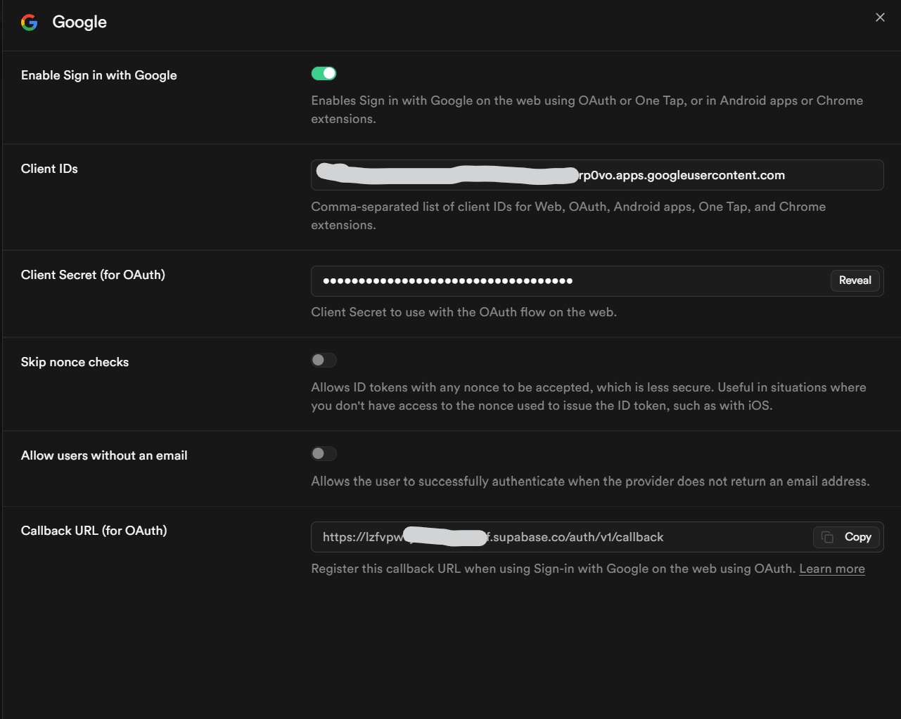

# 🔐 Google Sign-In Setup (Supabase + Google Cloud)

This guide walks you through enabling **Sign in with Google** for AI Creative Studio when running in **cloud mode**. It takes ~10 minutes.

> 💡 **Skip this if you only run locally.** Auth is bypassed by default (`BYPASS_AUTH = true` in `App.tsx`). You only need this guide when deploying or when you set `BYPASS_AUTH = false`.

---

## 📋 What you'll need

- A **Supabase project** already created (see [README — Supabase Setup](./README.md#️-supabase-setup))
- A **Google account** with access to [Google Cloud Console](https://console.cloud.google.com)
- ~10 minutes

---

## 🗺️ Big picture

You'll do this in **3 parts**:

1. **Supabase** → grab the Callback URL Google needs.
2. **Google Cloud** → create an OAuth app, paste the callback URL, get a Client ID + Secret.
3. **Supabase** → paste the Client ID + Secret back, enable the provider.

```
Supabase (get callback URL)  →  Google Cloud (create app)  →  Supabase (paste credentials)
```

---

## Part 1 — Get the Callback URL from Supabase

1. Open your Supabase project → **Authentication** (left sidebar) → **Providers**.
2. Click **Google** in the providers list.
3. Scroll to the bottom — find **Callback URL (for OAuth)** and click **Copy**.

   It looks like: `https://<your-project-ref>.supabase.co/auth/v1/callback`

4. **Keep this tab open** — you'll come back here in Part 3.



> 🔖 **Save this URL somewhere** — you'll paste it into Google Cloud next.

---

## Part 2 — Create the Google OAuth App

### 2.1 Create / select a project

1. Open [Google Cloud Console](https://console.cloud.google.com).
2. Top bar → project dropdown → **New Project** (or select an existing one). Name it whatever you like, e.g. `ai-creative-studio`.

### 2.2 Configure the OAuth consent screen

1. Left menu → **APIs & Services** → **OAuth consent screen**.
2. Choose **User Type**:
   - **Internal** → only users in your Google Workspace org can sign in. ✅ Recommended if you have Workspace and want to restrict access to your team.
   - **External** → any Google account can sign in (you'll filter by domain in the app — see end of guide).
3. Click **Create**, then fill in:
   - **App name:** `AI Creative Studio` (or your name)
   - **User support email:** your email
   - **Developer contact email:** your email
4. Click **Save and Continue** through the remaining steps (Scopes, Test users) — no changes needed.

### 2.3 Create the OAuth Client ID

1. Left menu → **APIs & Services** → **Credentials**.
2. Click **+ Create Credentials** → **OAuth client ID**.
3. **Application type:** `Web application`.
4. **Name:** `AI Creative Studio Web` (anything works).
5. Under **Authorized JavaScript origins**, click **+ Add URI** and add:
   - `http://localhost:3000` (for local dev)
   - `https://your-production-domain.com` (if you have one — skip if not)
6. Under **Authorized redirect URIs**, click **+ Add URI** and **paste the Supabase Callback URL you copied in Part 1**:

   ```
   https://<your-project-ref>.supabase.co/auth/v1/callback
   ```

   > ⚠️ This must be the **Supabase** callback URL, not `localhost`. Google sends users to Supabase first, which then redirects to your app.

7. Click **Create**. A dialog pops up showing your **Client ID** and **Client Secret** — copy both.

---

## Part 3 — Paste credentials back into Supabase

1. Return to the Supabase tab from Part 1 (**Authentication** → **Providers** → **Google**).
2. Toggle **Enable Sign in with Google** to **ON**.
3. Paste:
   - **Client IDs** → the Client ID from Google Cloud.
   - **Client Secret (for OAuth)** → the Client Secret from Google Cloud.
4. Leave **Skip nonce checks** and **Allow users without an email** **OFF**.
5. Click **Save** at the bottom.

✅ **Done.** Sign in with Google is now wired up.

---

## Part 4 — Enable auth in the app

1. Open `App.tsx` and change:

   ```typescript
   const BYPASS_AUTH = false;                  // was: true
   const ALLOWED_DOMAIN = 'yourcompany.com';   // your email domain
   ```

2. Restart the dev server: `npm run dev`.

That's it — the login screen will now show **Sign in with Google**, and only users with `@yourcompany.com` emails will be granted access.

---

## ✅ Test it

1. Open `http://localhost:3000` in an **incognito window**.
2. Click **Sign in with Google**.
3. Pick your Google account → grant consent → you should land back in the app, signed in.

If you used the wrong email domain, the app shows: *Access Restricted: You must use an @… email address.*

---

## 🔒 Restricting access — two layers

You can combine these for defense in depth:

| Layer | Where | How |
|---|---|---|
| **Workspace-only** (strongest) | Google Cloud → OAuth consent screen | Set **User Type = Internal**. Only your Workspace org can even attempt to sign in. |
| **Domain check** (app-level) | `App.tsx` | `ALLOWED_DOMAIN = 'yourcompany.com'` — rejects any email not ending in `@yourcompany.com`. |

For most teams, **Internal + ALLOWED_DOMAIN** is the safest combo.

---

## 🐛 Troubleshooting

| Problem | Fix |
|---|---|
| `redirect_uri_mismatch` from Google | The redirect URI in Google Cloud must **exactly** match the Supabase Callback URL — including `https://` and `/auth/v1/callback`. No trailing slash. |
| Signs in but app shows "Access Restricted" | `ALLOWED_DOMAIN` in `App.tsx` doesn't match the email's domain. Update it and restart. |
| Stuck on a blank page after Google consent | Check that `http://localhost:3000` (or your prod URL) is listed under **Authorized JavaScript origins** in Google Cloud. |
| "Provider not enabled" | The Google provider toggle in Supabase → Authentication → Providers is OFF. Turn it ON and **Save**. |
| Want to test without setting all this up | Keep `BYPASS_AUTH = true` in `App.tsx` — auth is skipped and a mock dev session is used. |

---

## 🔗 References

- [Supabase: Login with Google](https://supabase.com/docs/guides/auth/social-login/auth-google)
- [Google Cloud: OAuth 2.0 setup](https://support.google.com/cloud/answer/6158849)
- Back to [README](./README.md)
