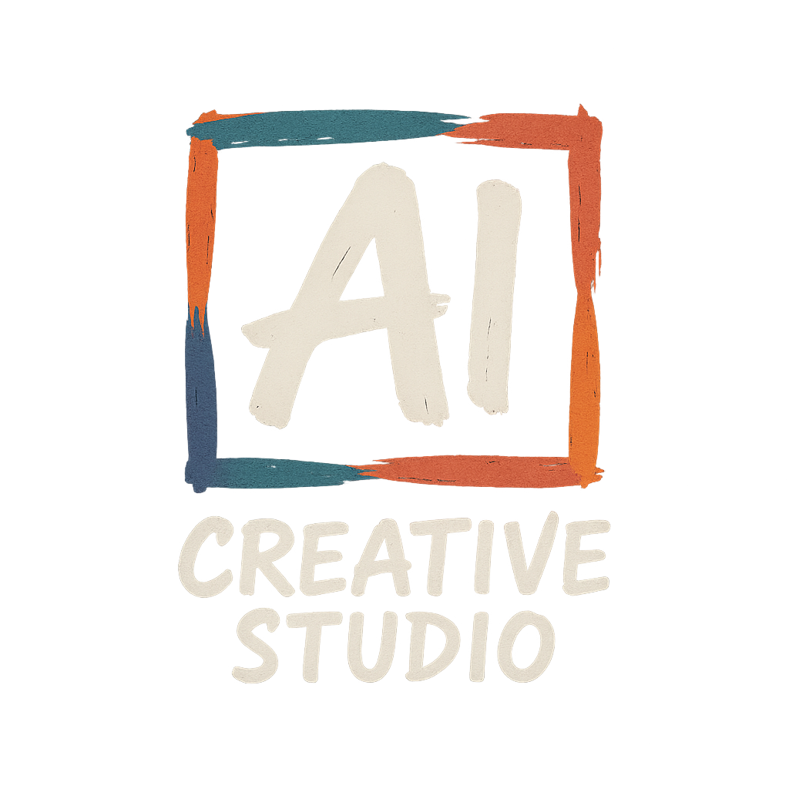
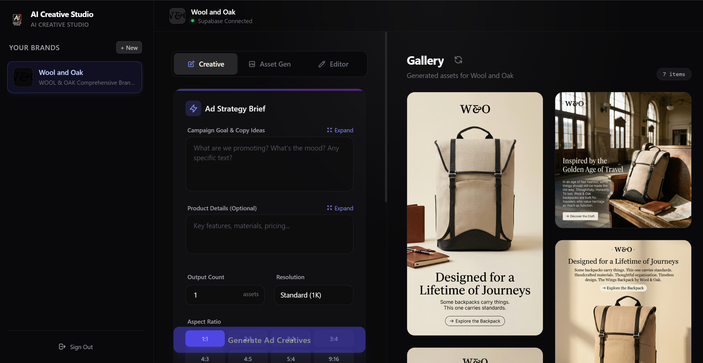
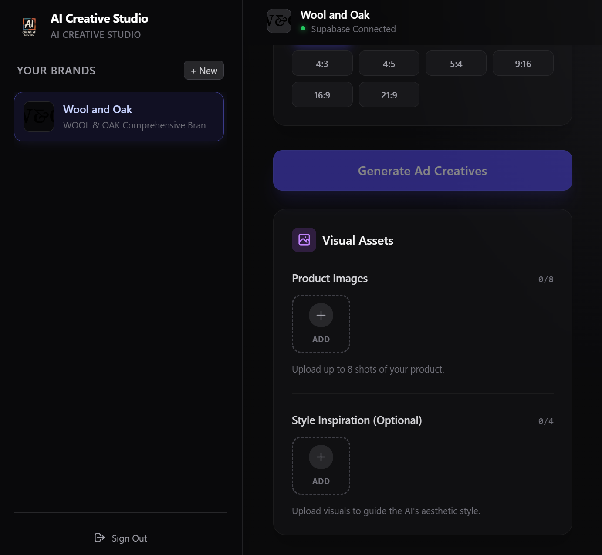
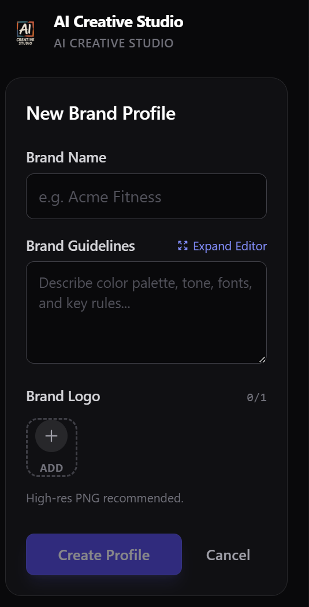
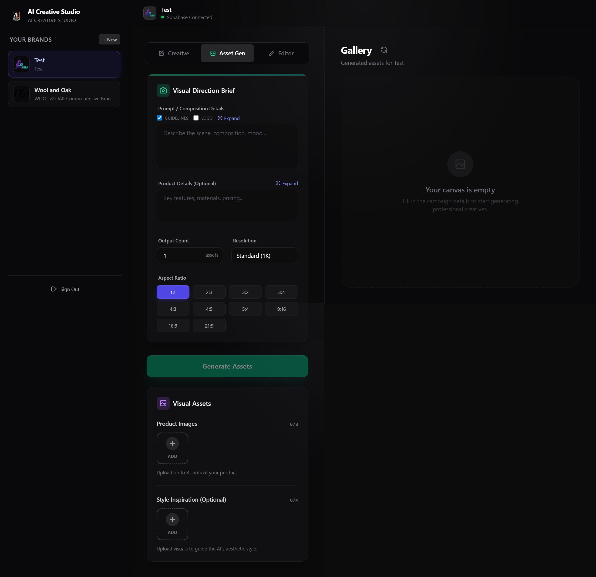
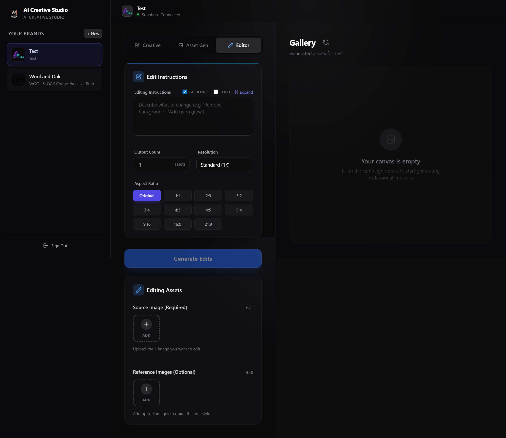

<div align="center">



# 🎨 AI Creative Studio

### Generate on-brand ad creatives & visual assets with AI — in seconds.

A creative workspace that turns a brand profile and a short brief into
production-ready marketing visuals, powered by Google Gemini.


</div>

> 🚧 **Under active development** — features and APIs may change between updates.
> Feedback and contributions are welcome.

<div align="center">
  
  <p><em>The workspace — write a brief on the left, watch on-brand creatives fill the gallery on the right.</em></p>
</div>

---

## ✨ What is it?

**AI Creative Studio** is an AI-powered design assistant for marketing teams,
founders, and creators. You define a **brand profile** once — name, guidelines,
logo — and the studio generates polished, on-brand visuals that respect your
look and feel. No design tools, no prompt-engineering expertise required.

Upload a few product shots, describe the campaign, pick an aspect ratio, and
generate a full set of ad creatives ready to ship to social, web, or print.

---

## 🚀 Features

| | Feature | Description |
|---|---------|-------------|
| 🏷️ | **Brand Profiles** | Save brand name, guidelines, and logo once — every generation stays on-brand. |
| 📢 | **Ad Creative mode** | Turn a campaign brief (goal, copy ideas, product details) into finished ad creatives. |
| 🖼️ | **Asset Generation mode** | Generate standalone visual assets from a composition brief, with optional logo + guideline injection. |
| ✏️ | **Editor mode** | Refine any image with natural-language edit instructions ("remove background", "add neon glow"). |
| 📤 | **Reference uploads** | Add up to **8 product images** and **4 style-inspiration images** to steer the AI. |
| 🗂️ | **Per-brand Gallery** | Every generated asset is stored and organized by brand. |
| 🌐 | **Dual environment** | Run fully local (SQLite + filesystem) or in the cloud (Supabase DB + Storage). |
| 🔐 | **Auth-ready** | Google OAuth via Supabase, with a one-flag bypass for local development. |

---

## 🎯 What you can use it for

- **Social ad campaigns** — batch-generate scroll-stopping creatives for Instagram, Facebook, and TikTok.
- **Product marketing** — turn plain product photos into styled lifestyle and hero shots.
- **Brand-consistent content** — keep every asset aligned to one set of brand guidelines.
- **Rapid concepting** — explore visual directions in minutes instead of days.
- **Creative editing** — iterate on existing assets without reopening a design tool.

---

## 📊 At a glance

| Metric | Value |
|--------|-------|
| Creative modes | **3** — Ad Creative · Asset Gen · Editor |
| Aspect ratios | **10** — from `1:1` square to `21:9` ultrawide |
| Max resolution | **4K** (1K / 2K / 4K) |
| Assets per batch | **Up to 10** |
| Reference inputs | **8** product images + **4** style images |
| Storage backends | **2** — local SQLite or Supabase cloud |

---

## 📸 Screenshots

<table>
  <tr>
    <td width="50%">
      <br/>
      <sub><b>Visual Assets</b> — upload product shots & style inspiration, pick from 10 aspect ratios.</sub>
    </td>
    <td width="50%">
      <br/>
      <sub><b>Brand Profiles</b> — define name, guidelines, and logo once.</sub>
    </td>
  </tr>
  <tr>
    <td width="50%">
      <br/>
      <sub><b>Asset Gen</b> — generate visuals from a composition brief.</sub>
    </td>
    <td width="50%">
      <br/>
      <sub><b>Editor</b> — refine any image with natural-language instructions.</sub>
    </td>
  </tr>
</table>

---

## 🧰 Tech Stack

- **Frontend:** React 18 · TypeScript · Vite 6
- **AI:** Google Gemini (`@google/genai`)
- **Backend (local):** Express 5 · Prisma 7 · SQLite
- **Backend (cloud):** Supabase (PostgreSQL + Storage)

---

## 📋 Prerequisites

- **Node.js** (v18 or higher recommended)
- **npm** or **yarn**
- **Gemini API Key** — [Get one here](https://aistudio.google.com/app/apikey)
- **Supabase Account** *(optional — only for cloud mode)* — [Sign up free](https://supabase.com)

---

## ⚡ Quick Start

```bash
# 1. Install dependencies
npm install

# 2. Copy environment template
cp .env.example .env.local

# 3. Fill in your credentials in .env.local

# 4. Run the app
npm run dev
```

Open [http://localhost:3000](http://localhost:3000) in your browser.

---

## 🔧 Environment Setup

1. **Copy the template file:**
   ```bash
   cp .env.example .env.local
   ```

2. **Edit `.env.local`** with your credentials:
   ```env
   # Gemini API Key (Required)
   GEMINI_API_KEY=your_actual_gemini_api_key

   # Supabase Credentials (Required for cloud features)
   SUPABASE_URL=https://your-project-id.supabase.co
   SUPABASE_ANON_KEY=your_supabase_anon_key
   ```

> ⚠️ **Important:** Never commit `.env.local` to version control!

---

## 🔐 Authentication Bypass (Development)

For local development, authentication is **bypassed by default**.

### To Enable/Disable Bypass:

Open `App.tsx` and find this line near the top:

```typescript
// --- DEVELOPMENT CONFIGURATION ---
// Set this to true to bypass Google Sign-In during development.
// Set to false for production to enforce authentication.
const BYPASS_AUTH = true;
```

| Value | Behavior |
|-------|----------|
| `true` | ✅ Bypass auth - App loads immediately (Development) |
| `false` | 🔐 Require Google Sign-In with allowed domain (Production) |

### Domain Restriction (Production)

When `BYPASS_AUTH = false`, only users with emails from your allowed domain can sign in. To change this, modify the `ALLOWED_DOMAIN` constant in `App.tsx`:

```typescript
const ALLOWED_DOMAIN = 'yourdomain.com';  // Change to your domain
```

---

## 🗄️ Supabase Setup

> Only needed for **cloud mode**. For local development, the app uses SQLite and
> local file storage out of the box — see [DEVELOPMENT.md](./DEVELOPMENT.md).

### 1. Create Supabase Project

1. Go to [supabase.com](https://supabase.com) and sign in
2. Click **"New Project"**
3. Fill in:
   - **Name:** `creative-studio` (or any name)
   - **Database Password:** Create a strong password (save it!)
   - **Region:** Choose closest to your users
4. Click **"Create new project"**
5. Wait for project to initialize (1-2 minutes)

### 2. Get Project Credentials

1. In your Supabase dashboard, go to **Project Settings** (gear icon)
2. Click **API** in the left sidebar
3. Copy these values to your `.env.local`:
   - **Project URL** → `SUPABASE_URL`
   - **anon/public key** → `SUPABASE_ANON_KEY`

Example:
```env
SUPABASE_URL=https://abcdefghijklmnop.supabase.co
SUPABASE_ANON_KEY=eyJhbGciOiJIUzI1NiIsInR5cCI6IkpXVCJ9...
```

### 3. Create Storage Bucket

1. In Supabase dashboard, go to **Storage** (left sidebar)
2. Click **"New bucket"**
3. Enter:
   - **Name:** `creatives`
   - **Public bucket:** ✅ Enable (toggle ON)
4. Click **"Create bucket"**

> 💡 The bucket name must be exactly `creatives` to match the app code.

### 4. Run SQL Setup

1. In Supabase dashboard, go to **SQL Editor** (left sidebar)
2. Click **"New query"**
3. **Copy and paste the ENTIRE SQL script below**
4. Click **"Run"** (or press Ctrl/Cmd + Enter)

<details>
<summary><b>📜 Click to expand the complete SQL setup script</b></summary>

```sql
-- ===========================================
-- AI CREATIVE STUDIO - DATABASE SETUP
-- ===========================================
-- Run this entire script in Supabase SQL Editor
-- This will create all tables, policies, and storage setup

-- ===========================================
-- STEP 1: CREATE TABLES
-- ===========================================

-- Brand Profiles Table
CREATE TABLE IF NOT EXISTS brand_profiles (
  id TEXT PRIMARY KEY,
  name TEXT,
  guidelines TEXT,
  logo_preview TEXT,
  created_at TIMESTAMP WITH TIME ZONE DEFAULT TIMEZONE('utc'::TEXT, NOW())
);

-- Generated Assets Table
CREATE TABLE IF NOT EXISTS generated_assets (
  id TEXT PRIMARY KEY,
  profile_id TEXT NOT NULL,
  url TEXT NOT NULL,
  prompt_used TEXT,
  aspect_ratio TEXT,
  created_at TIMESTAMP WITH TIME ZONE DEFAULT TIMEZONE('utc'::TEXT, NOW())
);

-- ===========================================
-- STEP 2: ENABLE ROW LEVEL SECURITY (RLS)
-- ===========================================

-- Enable RLS on brand_profiles
ALTER TABLE brand_profiles ENABLE ROW LEVEL SECURITY;

-- Enable RLS on generated_assets
ALTER TABLE generated_assets ENABLE ROW LEVEL SECURITY;

-- ===========================================
-- STEP 3: CREATE ACCESS POLICIES
-- ===========================================
-- These policies allow public CRUD access (suitable for development/internal tools)
-- For production with user accounts, you'd want more restrictive policies

-- Drop existing policies if they exist (prevents errors on re-run)
DROP POLICY IF EXISTS "Public Profiles Access" ON brand_profiles;
DROP POLICY IF EXISTS "Public Assets Access" ON generated_assets;

-- Allow full public access to brand_profiles (SELECT, INSERT, UPDATE, DELETE)
CREATE POLICY "Public Profiles Access" ON brand_profiles
  FOR ALL
  USING (true)
  WITH CHECK (true);

-- Allow full public access to generated_assets (SELECT, INSERT, UPDATE, DELETE)
CREATE POLICY "Public Assets Access" ON generated_assets
  FOR ALL
  USING (true)
  WITH CHECK (true);

-- ===========================================
-- STEP 4: SETUP STORAGE BUCKET
-- ===========================================

-- Create the 'creatives' bucket if it doesn't exist
INSERT INTO storage.buckets (id, name, public)
VALUES ('creatives', 'creatives', true)
ON CONFLICT (id) DO NOTHING;

-- ===========================================
-- STEP 5: STORAGE POLICIES
-- ===========================================

-- Drop existing storage policies if they exist
DROP POLICY IF EXISTS "Public Uploads" ON storage.objects;
DROP POLICY IF EXISTS "Public Reads" ON storage.objects;
DROP POLICY IF EXISTS "Public Deletes" ON storage.objects;

-- Allow public uploads to 'creatives' bucket
CREATE POLICY "Public Uploads" ON storage.objects
  FOR INSERT
  WITH CHECK (bucket_id = 'creatives');

-- Allow public reads from 'creatives' bucket
CREATE POLICY "Public Reads" ON storage.objects
  FOR SELECT
  USING (bucket_id = 'creatives');

-- Allow public deletes from 'creatives' bucket
CREATE POLICY "Public Deletes" ON storage.objects
  FOR DELETE
  USING (bucket_id = 'creatives');

-- ===========================================
-- ✅ SETUP COMPLETE!
-- ===========================================
-- Your database is now ready for AI Creative Studio
```

</details>

---

## ▶️ Running the App

### Development Mode

```bash
npm run dev
```

Opens at [http://localhost:3000](http://localhost:3000)

### Production Build

```bash
npm run build
npm run preview
```

> For the full local development guide (dual environments, scripts, database
> management, API endpoints), see **[DEVELOPMENT.md](./DEVELOPMENT.md)**.

---

## 🐛 Troubleshooting

### "Database not connected" Error

- Check that `SUPABASE_URL` and `SUPABASE_ANON_KEY` are set correctly in `.env.local`
- Restart the dev server after changing environment variables

### "RLS policy" or "Permission denied" Errors

- Make sure you ran the complete SQL setup script
- Check that RLS policies were created successfully in Supabase Dashboard > Authentication > Policies

### Images not uploading

- Verify the `creatives` storage bucket exists and is public
- Check storage policies in Supabase Dashboard > Storage > Policies

### Google Sign-In Issues (Production)

- Ensure `BYPASS_AUTH = false` in `App.tsx`
- Configure Google OAuth in Supabase Dashboard > Authentication > Providers > Google
- Set correct redirect URLs

### TypeScript Errors in IDE

If you see errors about `process` not being found, run:
```bash
npm install
```
These are dev-time warnings and won't affect runtime.

---

## 📄 License

Released under the **[MIT License](./LICENSE)** — free to use, modify, and
distribute. Just keep the copyright notice.

---

## 🔗 Links

- **Gemini API Keys:** https://aistudio.google.com/app/apikey
- **Supabase:** https://supabase.com
- **Development Guide:** [DEVELOPMENT.md](./DEVELOPMENT.md)
